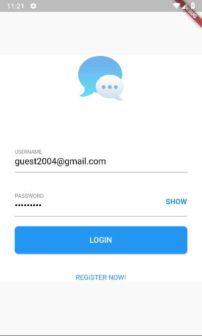
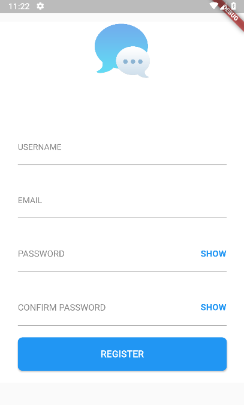
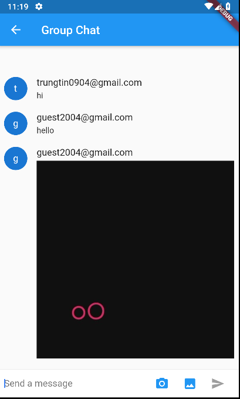

# MOBILE COURSE: 1ST EXERCISE - FLUTTER APP CHAT

## Function:
- Firebase Authencation: Login, Signin.
- Realtime Chat.
- Image sharing.

## What it looks like:
| LOGIN | SIGNIN | CHATSCREEN |
| ----- | ------ | ---------- |
|  |  |  |
